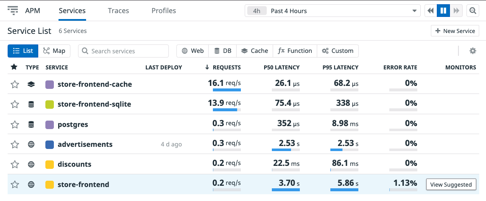

# Discovering a Suboptimal SQL Query

As noted before, with the Service List, we can see at a quick glance see endpoints that are running slower than the rest.

Now that we've got the time down on our requests, let's see if we can fix one more problematic SQL query.

See if you can spot anything specific in the Span Summary page under the `GET /discount` route of the `discouts-service`. Is there a specific span that's occuring much more often than the others? Maybe something with a higher Average Spans per trace?

It looks like we've got a classic N+1 query on our `discounts-service`. If you scroll in on a trace, there appears to be a _lot_ of trips to the database for each request.

It seems the last developer didn't realize the way they structured their code meant making multiple trips to the database when there shouldn't have been. 

Let's bring down our docker-compose terminal, by pressing `CTRL+c`, and then edit the Python file that defines our application.

There should be a line of code which states what happened, with a fix. Find the route definition that matches `/discount`, and edit the `discounts-service/discounts.py`{{open}} file, and see if the changes written work. The suggested changes should be in a comment right under the view definition.

With this, we've now made a great first attempt at improving the experience for our users. Let's update our version number in our `/deploy/docker-compose/docker-compose-broken-instrumented.yml`{{open}} to `1.1` for the `discounts` service.

While we're here, let's also enable profiling on both of our Python microservices by adding a `DD_PROFILING_ENABLED=true` to the set of environment variables.

With this, we can now spin back up our application, and see the difference in traces between our previous and current improvements.

## Adding Monitors to Our Services

Navigate to the [Datadog Services list](https://app.datadoghq.com/apm/services) page. When we click into each of the services we've configured in APM, we see some default suggestions for monitors. 

Let's add one of these monitors so we can tell when our applications latency has risen too high, ensuring we are quickly alerted and are able to fix the issue.

In this case, we are going to enable the default suggested `P90` latency monitor to the `store-frontend`, so we can tell when things are taking too long to respond.