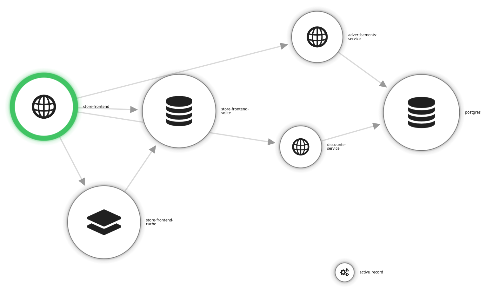
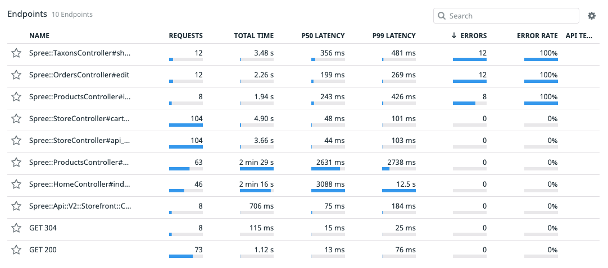
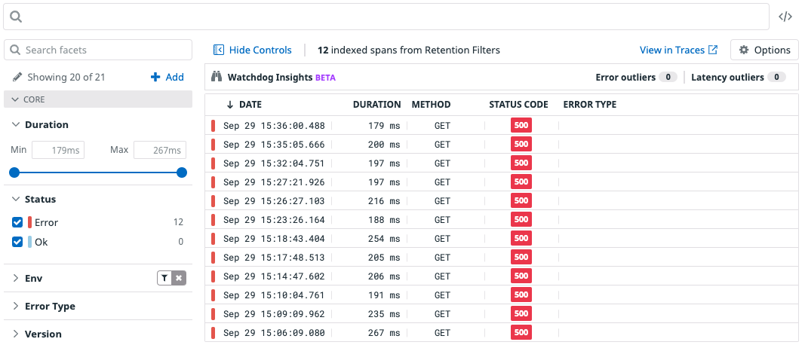

We'll start by looking at the Service Map, to get an idea for our current infrastructure and microservice dependencies.



In doing so, we can tell that we've got two microservices that our frontend calls, a `discounts-service`, along with an `advertisements-service`.

If we navigate to our Service List in Datadog, we can see which services are throwing any errors, at a glance.


So let's take a look at the frontend service, and see if we can find the spot where things are breaking.

If we look into the service, we can see that it's been laid out by views. There's at least one view that seems to only give errors.



Let's click into that view and see if a trace from that view can tell us what's going on.



It seems the problem happens in a template. Let's get rid of that part of the template so we can get the site back up and running while figuring out what happened.


## Deploying the Fixed Code

After identifying the specific view template issue, our engineers went ahead and create an updated image for us with this code removed. 

Since this code has already been deployed to the new Docker image `ddtraining/storefront-fixed:2.0.0`, we just need to update our config to use the new image.

Edit the `docker-compose.yml`{{open}}, changing the `frontend` image on **line 62**:

```
  image: "ddtraining/storefront-fixed:2.0.0"
```

It's also recommended to update the `DD_VERSION` so that we can track performance changes across versions. Let's set this to `2.1`.

With the updates in place, we need to restart our service. Click back over to our terminal and restart our services with: `docker-compose down && docker-compose up -d`{{execute}}

This will start up our application using the changes made to the yaml file. Let's see if there's anything else going on. Let's wait a few minutes for our new services to come up and our deployment to begin receiving traffic.
